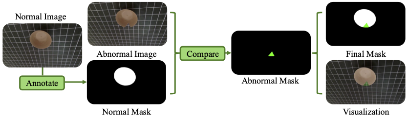

# RAD: A Dataset and Benchmark for Real-Life Anomaly Detection with Robotic Observations

Kaichen Zhou, Yang Cao[†], Teawhan Kim[†], Hao Zhao, Hao Dong, Kai Ming Ting, and Ye Zhu

[†] Equal Contribution

This repository provides the official PyTorch implementation code, data and models of the RAD.

Our paper has been submitted to "International Journal of Computer Vision". 

**Abstract:** 
*Recent advancements in industrial anomaly detection have been hindered by the lack of realistic datasets that accurately represent real-world conditions. Existing algorithms are often developed and evaluated using idealized datasets, which deviate significantly from real-life scenarios characterized by environmental noise and data corruption such as fluctuating lighting conditions, variable object poses, and unstable camera positions. To address this gap, we introduce the Realistic Anomaly Detection (RAD) dataset, the first multi-view RGB-based anomaly detection dataset specifically collected using a real robot arm, providing unique and realistic data scenarios. RAD comprises 4765 images across 13 categories and 4 defect types, collected from more than 50 viewpoints, providing a comprehensive and realistic benchmark. This multi-viewpoint setup mirrors real-world conditions where anomalies may not be detectable from every perspective. Moreover, by sampling varying numbers of views, the algorithm's performance can be comprehensively evaluated across different viewpoints. This approach enhances the thoroughness of performance assessment and helps improve the algorithm's robustness. Besides, to support 3D multi-view reconstruction algorithms, we propose a data augmentation method to improve the accuracy of pose estimation and facilitate the reconstruction of 3D point clouds. We systematically evaluate state-of-the-art RGB-based and point cloud-based models using RAD, identifying limitations and future research directions.*<br>

<p align="center">
  
</p>

The main contributions are summarized as follows: 
- **Dataset Introduction**: Developed the first real-world multi-view anomaly detection dataset with robotic observations, covering over 10 object categories and both texture and geometry-based defects.
- **NAD Challenge**: Proposed the Noisy-Pose-Based Anomaly Detection (NAD) challenge to evaluate algorithm robustness in real-robot scenarios with noisy poses.
- **Preprocessing Methods**: Introduced advanced data preprocessing techniques to handle noisy and inconsistent data in multi-view and point cloud datasets.
- **Algorithm Evaluation**: Assessed 2D RGB, 3D multi-view, and 3D point cloud algorithms on the dataset, highlighting their strengths and weaknesses.

## 1. Description of RAD dataset

### 1.1 Data Acquisition

#### Details of data annotation
<p align="center">
  
</p>

#### Anomaly types
To ensure the dataset's utility in evaluating robustness against common industrial defects, we simulated four prevalent classes of anomalies as follows:
- **Scratched** is generated by scribing the object's surface with a sharp implement.
- **Missing** is simulated by removing segments from the objects.
- **Stained** is generated by applying discoloring agents to localized areas of the objects.
- **Squeezed** is created by applying pressure to deform parts of the objects.

<p align="center">
  
</p>

### 1.2 Data Statistics

The RAD dataset comprises a total of 5,848 samples, distributed across 12 distinct objects that encompass multiple domains, including kitchenware, toys, and daily necessities. The categories in RAD dataset exhibit significant diversity in shapes and appearances, providing extensive semantic and geometrical exploration spaces that facilitate a wide range of research objectives. In addition, the data set also includes metadata (camera pose) for each image, which is essential for nuanced analyses and model training enhancements.


<p align="center">
  
</p>

### 1.3 Data Directory

To facilitate the testing of baselines, we use the same data structure as in PAD and MVTec. You could download our dataset with [Google Drive](https://drive.google.com/drive/folders/1_KEx4jZvpTh5lpuFWjrpk7EmUhIyer2G?usp=sharing). In this version, we provide all image with the help of ground truth mask.

```
RAD
 └ binderclip                   ---Object class folder.
   └ train                      ---Training set, fit your model on this data.
     └ good                     ---a set of defect-free training images.
       └ num.png
   └ test                       ---a test set of images.
     └ missing                  ---images with missing.
       └ num.png
     └ scratched                ---images with scratched. 
     └ squeezed                 ---images with squeezed. 
     └ stained                  ---images with stained. 
     └ good                     ---images without defects.
   └ ground_truth               ---GT segmentation mask for various kinds of defects.
     └ missing
       └ num_mask.png
     └ scratched
     └ squeezed
     └ stained
   └ transforms.json            ---Provides information related to the camera angle and image transformation matrix for training.
 └ box
    ...
```

## 2. Description of Pose Estimation & 3D Reconstruction

Considering the challenges of the NAD problem, directly applying 3D-based anomaly detection methods introduces significant uncertainty. Current multi-view methods, such as MVSNeRF, NEUS, and 3D Gaussian, depend heavily on accurate pose estimation. These multi-view reconstruction methods specifically rely on high-quality pixel-wise matching between different images, which is significantly influenced by the relative positional information between frames.
To address this issue, we propose a pipeline to estimate the pose from different views, enabling multi-view based anomaly detection algorithms. Furthermore, we apply 3D reconstruction to create a 3D point cloud, facilitating the use of 3D point cloud-based anomaly detection algorithms.

<p align="center">
  
</p>


## 3. Baseline Running

We introduce a dataset comprising multi-view images and evaluate its fidelity using 2D feature embedding-based anomaly detection methodologies, specifically FastFlow, STPM, CFA, cflow and CDO.
2D reconstruction-based anomaly detection methodologies, specifically FAVAE and UniAD. These methods leverage neural networks to learn representations conducive to accurately reconstructing normal samples, with anomalies detected based on deviations in the reconstruction quality. 
Additionally, we investigate the effectiveness of PAD and Splat, a 3D multi-view reconstruction-based algorithm. Notably, both 2D and 3D reconstruction-based methods exhibit limitations. The discrepancy is primarily attributed to misalignment between the training and testing sets, compounded by variations in lighting conditions that impact image quality. 

| **Model**               | **Cate.** | **blinder.** | **bowl.** | **box**  | **can**  | **charger** | **cup1.** | **cup2.** |
|-------------------------|-----------|--------------|-----------|----------|----------|-------------|-----------|-----------|
| **FastFlow** [1]         | P-ROC     | 65.33%       | 67.90%    | 74.60%   | 66.30%   | 99.50%      | 65.60%    | 71.15%    |
|                         | I-ROC     | 89.60%       | 78.70%    | 97.80%   | 88.10%   | 81.10%      | 86.60%    | 71.43%    |
| **STPM** [2]            | P-ROC     | 67.83%       | 73.50%    | 78.50%   | 67.60%   | 55.80%      | 74.90%    | 74.15%    |
|                         | I-ROC     | 75.87%       | 70.90%    | 87.10%   | 72.40%   | 88.50%      | 88.30%    | 71.15%    |
| **CFA** [3]             | P-ROC     | 68.41%       | 70.29%    | 76.78%   | 67.58%   | 79.01%      | 75.14%    | 72.53%    |
|                         | I-ROC     | 88.60%       | 79.44%    | 99.67%   | 89.43%   | 92.62%      | 93.87%    | 71.30%    |
| **cflow** [4]           | P-ROC     | 68.45%       | 73.70%    | 79.26%   | 67.78%   | 71.18%      | 75.72%    | 74.52%    |
|                         | I-ROC     | 85.38%       | 83.76%    | 99.89%   | 92.41%   | 91.80%      | 93.87%    | 73.33%    |
| **CDO** [5]             | P-ROC     | 96.42%       | 60.33%    | 84.67%   | 87.77%   | 97.15%      | 81.85%    | 60.63%    |
|                         | I-ROC     | 58.63%       | 64.89%    | 72.06%   | 50.53%   | 66.96%      | 43.82%    | 84.10%    |
| **UniAD** [6]           | P-ROC     | 98.75%       | 93.88%    | 98.58%   | 98.69%   | 97.88%      | 95.56%    | 92.28%    |
|                         | I-ROC     | 66.30%       | 43.09%    | 71.02%   | 59.53%   | 64.62%      | 59.71%    | 51.81%    |
| **FAVAE** [7]           | P-ROC     | 57.20%       | 57.30%    | 35.50%   | 83.90%   | 59.60%      | 45.70%    | 62.60%    |
|                         | I-ROC     | 49.10%       | 53.50%    | 52.10%   | 33.50%   | 53.40%      | 60.70%    | 29.50%    |
| **PAD** [8]             | P-ROC     | 90.50%       | 75.80%    | 90.30%   | 98.10%   | 97.30%      | 96.10%    | 79.20%    |
|                         | I-ROC     | 48.00%       | 37.00%    | 62.00%   | 46.30%   | 51.50%      | 48.50%    | 54.40%    |
| **Splat** [9]           | P-ROC     | 98.30%       | 96.80%    | 97.90%   | 98.20%   | 99.70%      | 98.00%    | 97.45%    |
|                         | I-ROC     | 52.07%       | 80.60%    | 55.50%   | 37.70%   | 57.40%      | 81.20%    | 48.10%    |

| **Model**               | **Cate.** | **glue.** | **phone.** | **rubber.** | **spoon.** | **spray.** | **tennis.** | **Aver.** |
|-------------------------|-----------|-----------|------------|-------------|------------|------------|-------------|-----------|
| **FastFlow** [1]         | P-ROC     | 75.60%    | 74.43%     | 73.40%      | 72.00%     | 74.00%     | 71.00%      | 73.14%    |
|                         | I-ROC     | 77.85%    | 94.78%     | 97.10%      | 82.30%     | 85.50%     | 98.00%      | 86.83%    |
| **STPM** [2]            | P-ROC     | 76.75%    | 82.35%     | 73.80%      | 72.60%     | 74.60%     | 72.00%      | 72.64%    |
|                         | I-ROC     | 69.75%    | 85.85%     | 77.00%      | 79.90%     | 82.80%     | 98.00%      | 80.58%    |
| **CFA** [3]             | P-ROC     | 76.40%    | 74.33%     | 71.71%      | 74.96%     | 73.63%     | 84.39%      | 74.24%    |
|                         | I-ROC     | 80.46%    | 93.60%     | 78.03%      | 86.53%     | 84.28%     | 97.00%      | 87.29%    |
| **cflow** [4]           | P-ROC     | 77.00%    | 76.35%     | 74.12%      | 77.18%     | 76.79%     | 79.07%      | 74.70%    |
|                         | I-ROC     | 81.06%    | 95.96%     | 98.50%      | 89.85%     | 83.02%     | 98.00%      | 89.76%    |
| **CDO** [5]             | P-ROC     | 95.93%    | 87.86%     | 90.47%      | 97.21%     | 83.12%     | 97.50%      | 86.22%    |
|                         | I-ROC     | 75.57%    | 63.65%     | 46.14%      | 70.76%     | 52.98%     | 55.27%      | 61.95%    |
| **UniAD** [6]           | P-ROC     | 97.97%    | 97.57%     | 98.16%      | 99.31%     | 98.01%     | 99.35%      | 97.38%    |
|                         | I-ROC     | 56.37%    | 71.88%     | 65.50%      | 75.92%     | 57.90%     | 68.53%      | 62.48%    |
| **FAVAE** [7]           | P-ROC     | 60.10%    | 24.60%     | 90.40%      | 59.40%     | 55.40%     | 87.50%      | 60.20%    |
|                         | I-ROC     | 66.40%    | 70.40%     | 39.10%      | 61.00%     | 55.30%     | 54.50%      | 50.30%    |
| **PAD** [8]             | P-ROC     | 87.30%    | 89.70%     | 88.20%      | 85.40%     | 94.30%     | 85.10%      | 91.20%    |
|                         | I-ROC     | 71.30%    | 69.50%     | 70.20%      | 61.40%     | 68.20%     | 64.50%      | 66.20%    |
| **Splat** [9]           | P-ROC     | 99.12%    | 98.10%     | 99.80%      | 97.30%     | 97.20%     | 95.80%      | 96.20%    |
|                         | I-ROC     | 66.30%    | 71.00%     | 53.40%      | 57.40%     | 73.60%     | 68.10%      | 62.50%    |