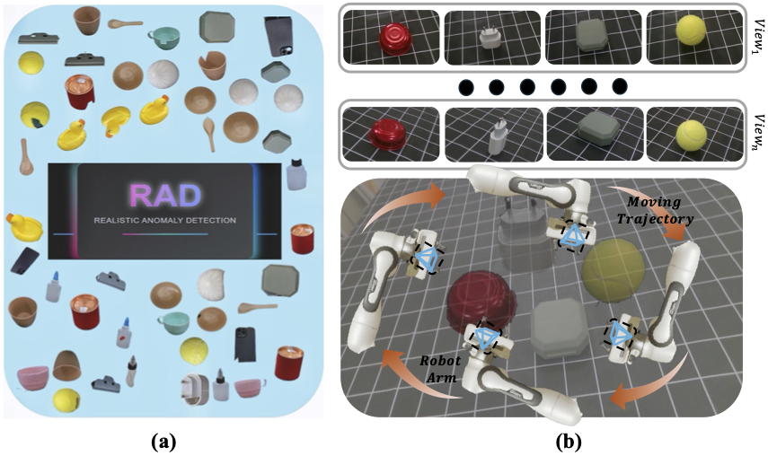
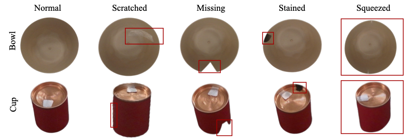
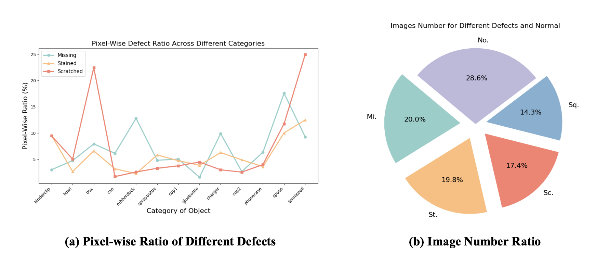
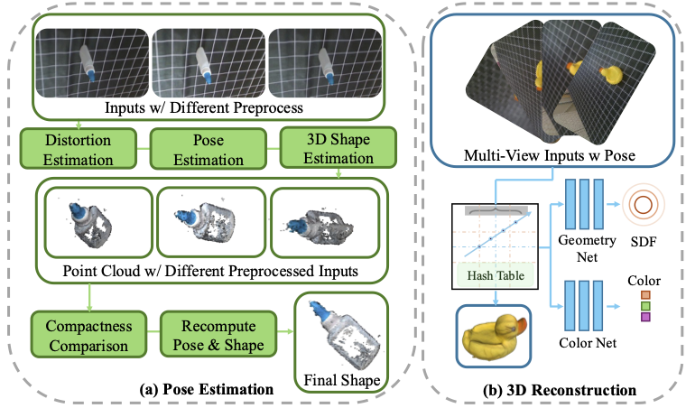

# RAD: A Dataset and Benchmark for Real-Life Anomaly Detection with Robotic Observations

Kaichen Zhou, Yang Cao[†], Teawhan Kim[†], Hao Zhao, Hao Dong, Kai Ming Ting, and Ye Zhu

[†] Equal Contribution

This repository provides the official PyTorch implementation code, data and models of the RAD.

[[Link to paper]](https://arxiv.org/abs/2312.15268) [[Dataset with mask]](https://drive.google.com/file/d/1p3v2FeNlHinXFCTZzZujhYhCGUiOL38G/view?usp=drive_link) [[Dataset without mask]](https://drive.google.com/file/d/1cPeHh69vErvC3yZSejyxU4SNK9fVlJWL/view?usp=drive_link)

Our paper has been submitted to "International Journal of Computer Vision". 

<p align="center">
  
</p>

The main contributions are summarized as follows: 
- **Dataset Introduction**: Real-world multi-view anomaly dataset with robotic observations.
- **NAD Challenge**: Proposed the Noisy-Pose-Based Anomaly Detection (NAD) challenge.
- **Preprocessing Methods**: Introduced data preprocessing techniques to handle raw data.
- **Algorithm Evaluation**: Assessed multiple anomaly detection algorithms on the dataset.

## 1. Description of RAD dataset

### 1.1 Anomaly types
To ensure the dataset's utility in evaluating robustness against common industrial defects, we simulated four prevalent classes of anomalies as follows: **Scratched**, **Missing**, **Stained** and **Squeezed**.

<p align="center">
  
</p>

### 1.2 Data Statistics

The RAD dataset comprises a total of 4287 samples, distributed across 13 distinct categories that encompass multiple domains, including kitchenware, toys, and daily necessities. 


<p align="center">
  
</p>

### 1.3 Data Directory

To facilitate the testing of baselines, we use the same data structure as in PAD and MVTec. You could download our dataset with [RAD with Mask](https://drive.google.com/file/d/1p3v2FeNlHinXFCTZzZujhYhCGUiOL38G/view?usp=drive_link) and [RAD without Mask](https://drive.google.com/file/d/1cPeHh69vErvC3yZSejyxU4SNK9fVlJWL/view?usp=drive_link). In this version, we provide all image with the help of ground truth mask.

```
RAD
 └ binderclip                   ---Object class folder.
   └ train                      ---Training set, fit your model on this data.
     └ good                     ---a set of defect-free training images.
       └ num.png
   └ test                       ---a test set of images.
     └ missing                  ---images with missing.
       └ num.png
     └ scratched                ---images with scratched. 
     └ squeezed                 ---images with squeezed. 
     └ stained                  ---images with stained. 
     └ good                     ---images without defects.
   └ ground_truth               ---GT segmentation mask for various kinds of defects.
     └ missing
       └ num_mask.png
     └ scratched
     └ squeezed
     └ stained
   └ transforms.json            ---Provides information related to the camera angle and image transformation matrix for training.
 └ box
    ...
```

## 2. Description of Pose Estimation & 3D Reconstruction

### 2.1 Pipeline
Considering the challenges of the NAD problem, directly applying 3D-based anomaly detection methods introduces significant uncertainty. Current multi-view methods, such as MVSNeRF, NEUS, and 3D Gaussian, depend heavily on accurate pose estimation. 
To address this issue, we propose a pipeline to estimate the pose from different views, enabling multi-view based anomaly detection algorithms. 

<p align="center">
  
</p>


### 2.2 Pipeline

We provide an example about our proposed data preprocess pipeline, you could test it with our provided subset of our dataset [toy example](https://drive.google.com/file/d/1dUOSWrQER2HFkDobWYUqeGdy12v46iHt/view?usp=drive_link). And place it under current directory.

Using proposed preprocessing methods to enchance pose estimation quality.
```
python pose_estimation.py
```

Transfer estimated pose to format required for 3D Gaussian Splatting.
```
camera_transfer.py
```

## Citation
If you find our work useful or interesting, please cite our paper:

```latex
@article{zhou2024rad,
  title={RAD: A Dataset and Benchmark for Real-Life Anomaly Detection with Robotic Observations},
  author={Zhou, Kaichen and Cao, Yang and Kim, Teawhan and Zhao, Hao and Dong, Hao and Ting, Kai Ming and Zhu, Ye},
  journal={arXiv preprint arXiv:2410.00713},
  year={2024}
}
```

