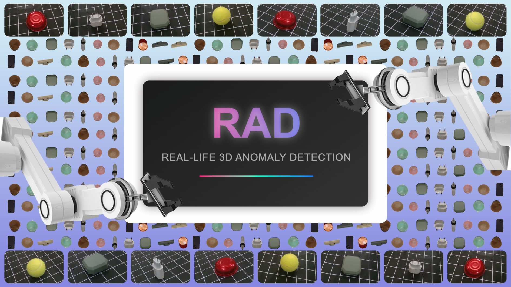

<div align="center">

# RAD: A Realistic Multi-View Benchmark for Pose-Agnostic Anomaly Detection

**Kaichen Zhou\*** · **Xinhai Chang\*** · **Taewhan Kim\*** · **Jiadong Zhang\*** · **Yang Cao** · **Chufei Peng** · **Fangneng Zhan** · **Hao Zhao** · **Hao Dong** · **Kai Ming Ting** · **Ye Zhu**

<sup>\* Equal contribution</sup>

[Paper](https://arxiv.org/abs/2410.00713) · [PDF](https://arxiv.org/pdf/2410.00713) · [Project page](https://chang-xinhai.github.io/rad-website/) · [Dataset](#dataset) · [Code](https://github.com/kaichen-z/RAD)

[](https://arxiv.org/abs/2410.00713)
[](https://github.com/kaichen-z/RAD/actions/workflows/ci.yml)
[](LICENSE)

</div>



RAD is a robot-captured benchmark for anomaly detection under changing viewpoints, uncontrolled
illumination, reflective materials, and viewpoint-dependent defect visibility. It contains
**4,287 RGB images**, **13 semantic object categories** represented by **18 physical instances**,
and four defect types: scratched, missing, stained, and squeezed. Each object instance is
captured from 68 predefined robot viewpoints with a Franka Emika Panda and Intel RealSense D415.

## News

- **2026-07:** Public benchmark adapters, validation tools, and project page released.
- **2024-10:** RAD first appeared on arXiv.

## Overview

RAD targets **pose-agnostic anomaly detection**: training uses only defect-free views and a test
image arrives at an unknown pose. A method must separate a real defect from normal changes caused
by pose, shading, reflection, or partial occlusion. The paper evaluates three families:

- **2D feature methods:** CFlow, EfficientAD, FastFlow, PaDiM, PatchCore, Reverse Distillation,
  STFPM, UFlow, WinCLIP, AdaCLIP, and VCP-CLIP.
- **3D reconstruction methods:** SplatPose and PIAD, using COLMAP-estimated camera poses from
  unmasked images rather than robot ground-truth poses.
- **Vision-language models:** Qwen2.5-VL and GPT-4o, evaluated with classification, bounding-box
  localization, and box-to-mask conversion.

The main result is that mature 2D feature methods remain strongest for image-level detection;
VCP-CLIP leads pixel-level AUROC, while the 3D methods are competitive at localization but remain
sensitive to reflection, symmetry, and sparse views.

## Dataset

Hosted downloads:

- [RAD with pixel masks](https://drive.google.com/file/d/1p3v2FeNlHinXFCTZzZujhYhCGUiOL38G/view)
- [RAD without masks](https://drive.google.com/file/d/1cPeHh69vErvC3yZSejyxU4SNK9fVlJWL/view)

The paper reports 13 semantic categories: binder clip, bowl, box, can, charger, cup 1, cup 2,
glue bottle, phone case, rubber duck, spoon, spray bottle, and tennis ball. Multiple physical
instances of binder clip, cup 2, glue bottle, and phone case are kept in separate directories and
aggregated into their semantic category for reporting.

```text
RAD_with_mask/
├── binderclip/
│   ├── train/good/                 # normal training views
│   ├── test/good/                  # normal test views
│   ├── test/{missing,...}/         # anomalous test views
│   ├── ground_truth/{missing,...}/ # pixel masks
│   └── transforms.json             # camera metadata when included
├── binderclip2/
└── ...                             # 18 physical-instance directories
```

After extracting an archive, validate paths, masks, counts, and optional pose metadata:

```bash
rad-benchmark validate /path/to/RAD_with_mask
rad-benchmark validate /path/to/RAD_with_mask --require-poses --output validation.json
```

The hosted download links are retained from the earlier repository. The code license in this
repository does not automatically grant rights to the dataset; consult the dataset distribution
and authors for its applicable terms.

## Setup

The release utilities require Python 3.10 or newer and do not require a GPU:

```bash
git clone https://github.com/kaichen-z/RAD.git
cd RAD
conda env create -f environment.yml
conda activate rad-benchmark
```

Or use a virtual environment:

```bash
python -m venv .venv
source .venv/bin/activate
python -m pip install --upgrade pip
pip install -e .
```

Heavy baselines need their own CUDA-compatible environments. Fetch only the method you intend to
run; pinned revisions and license notes live in [`methods/manifest.toml`](methods/manifest.toml).

## Quick start

Generate portable metadata for CLIP methods:

```bash
rad-benchmark metadata /path/to/RAD_with_mask work/rad-meta.json
python methods/adaclip/rad_dataset.py work/rad-meta.json --summary
```

Run one paper baseline through the direct Anomalib adapter:

```bash
pip install -e '.[anomalib]'
rad-benchmark anomalib /path/to/RAD_with_mask outputs/anomalib \
  --model patchcore --instances binderclip
```

Convert provider-neutral VLM box responses into pixel masks:

```bash
rad-benchmark vlm-masks responses.json /path/to/RAD_with_mask outputs/vlm-masks
```

See [`methods/README.md`](methods/README.md) for CLIP and 3D setup, pinned upstream revisions, and
license boundaries. No script embeds API keys, downloads model weights implicitly, or assumes a
machine-specific path.

## Paper benchmark

Mean AUROC values below are transcribed from the current paper tables.

| Family | Method | Image AUROC | Pixel AUROC |
|---|---|---:|---:|
| Feature | CFlow | 0.618 | 0.984 |
| Feature | EfficientAD | 0.803 | 0.940 |
| Feature | FastFlow | 0.786 | 0.912 |
| Feature | PaDiM | 0.587 | 0.972 |
| Feature | PatchCore | **0.833** | 0.978 |
| Feature | Reverse Distillation | 0.784 | 0.984 |
| Feature | STFPM | 0.679 | 0.973 |
| Feature | UFlow | 0.608 | 0.951 |
| Zero-shot | WinCLIP | 0.646 | 0.853 |
| Zero-shot | AdaCLIP | 0.627 | 0.960 |
| Zero-shot | VCP-CLIP | 0.663 | **0.987** |
| 3D | SplatPose | 0.524 | 0.977 |
| 3D | PIAD | 0.634 | 0.984 |
| VLM | Qwen2.5-VL | 0.305 | 0.538 |
| VLM | GPT-4o | 0.517 | 0.517 |

Image- and pixel-level AUROC are the primary metrics. Semantic-category results aggregate the
corresponding physical instances; avoid treating the 18 directories as 18 paper categories.

## What changed from the research repository

This public release preserves the benchmark protocol while replacing machine-specific research
code with small, auditable adapters:

- removed full copies of third-party projects, nested submodules, checkpoints, logs, generated
  results, notebooks, editor settings, and unused AnySplat/PAD/NeRF experiments;
- added a direct Anomalib `Folder` adapter for the eight feature models and WinCLIP;
- added root-independent AdaCLIP metadata loading and a collision-safe VCP-CLIP converter;
- added non-destructive SplatPose preparation and a portable PIAD config adapter; because the
  PIAD project-page repository does not currently contain method source, this release does not
  claim an executable PIAD reproduction;
- added a provider-neutral VLM JSON prompt and deterministic box-to-mask implementation;
- added validation, smoke tests, CI, contribution/security policy, citation metadata, and explicit
  upstream revisions and licenses.

These are integration changes only; RAD does not relicense or redistribute third-party method
implementations or weights.

## Citation

```bibtex
@misc{zhou2024rad,
  title         = {RAD: A Realistic Multi-View Benchmark for Pose-Agnostic Anomaly Detection},
  author        = {Zhou, Kaichen and Chang, Xinhai and Kim, Taewhan and Zhang, Jiadong and Cao, Yang and Peng, Chufei and Zhan, Fangneng and Zhao, Hao and Dong, Hao and Ting, Kai Ming and Zhu, Ye},
  year          = {2024},
  eprint        = {2410.00713},
  archivePrefix = {arXiv},
  primaryClass  = {cs.CV},
  doi           = {10.48550/arXiv.2410.00713},
  url           = {https://arxiv.org/abs/2410.00713}
}
```

## License

RAD-authored code in this repository is released under the [MIT License](LICENSE). Dataset,
upstream method, model-weight, and service-provider terms are separate; see
[`methods/manifest.toml`](methods/manifest.toml).

## Acknowledgements

The benchmark adapters build on Anomalib, AdaCLIP, VCP-CLIP, SplatPose, PIAD, COLMAP, and their
underlying open-source dependencies. We thank their authors and the hardware/software communities
that make reproducible robotic vision research possible.
